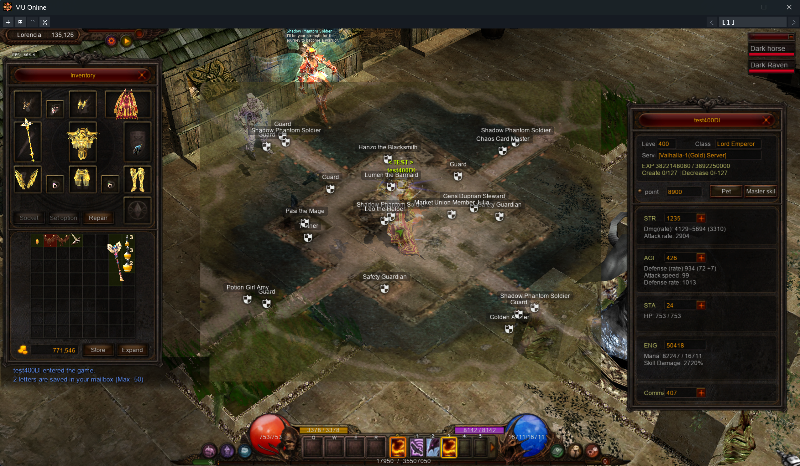
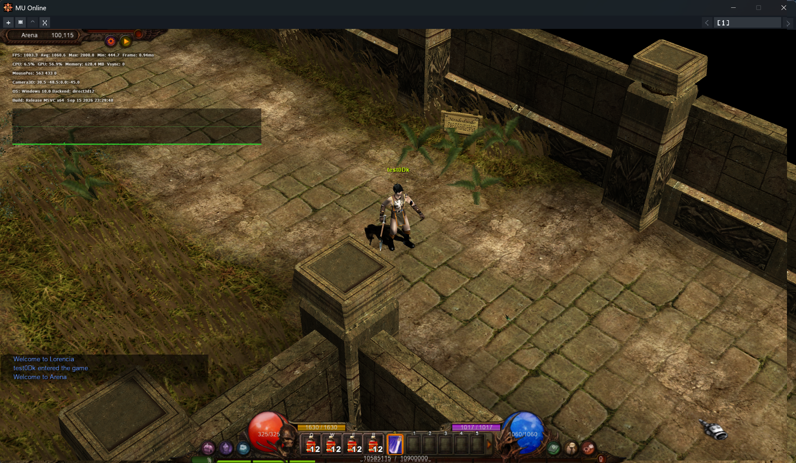

# Mu Client & Launcher (Season 6*)

This is a slop generated by AI. So no source is ready to public + bugs are expected.

- **1000 FPS** - Reachable - but I suggest to use Vsync or FPS Limit at 60 or below.
- **MuLauncher.exe** — starts the game through the Mu launcher.
- **Main.exe** — the main 64-bit release client.
- **32-bit and 64-bit builds** — additional builds are included for compatibility and testing.
- **Game data and configuration** — the files required to run the client.
- **Forked** - https://github.com/sven-n/MuMain
- **Server** - https://github.com/MUnique/OpenMU 
- **I didn't touch anything in MUnique.Client.Library.dll** - may need some extra works on that C# library to make it compatiple with other servers.
- **Commands list: see MuMain**

## Getting Started

1. Download and extract the complete release package.
2. Change server connection config
3. Run **MuLauncher.exe** to start the game.

## Configuration

### UI

- `RmlScale` — In-game UI size, from `100` to `200`. `160` means 160% size.
- `ControlUIScale` — Control UI (top bar) size, from `100` to `200`.

### Performance

- `RendererBackend` — Graphics API: `auto`, `direct3d12`, or `vulkan`. Keep `auto` unless troubleshooting graphics issues.
- `VSync` — Synchronizes frames with the monitor: `1` enabled, `0` disabled.
- `RenderPipeline` — Rendering mode: `0` uses immediate rendering; `1` enables the three-stage pipeline (consume extra memory).
- `FpsLimit` — Maximum presentation FPS. Use `0` for unlimited FPS.
- `SessionWorkerCount` — Number of background workers used by the client. Valid range: `2`–`64`; default: `8`.
- `SharedAssetIdleSeconds` — Time, in seconds, to keep world assets in cache (warp between 2 maps without reloading).
## Screenshots

---

**Version:** V1.0  
**Release date:** September 17, 2026
